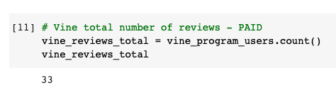
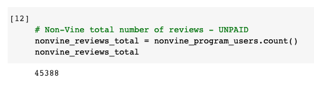
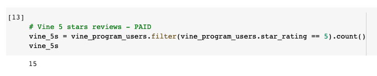
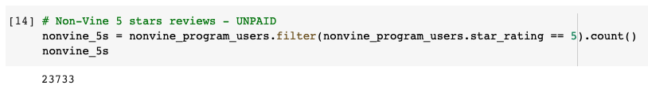
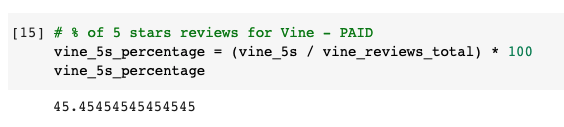
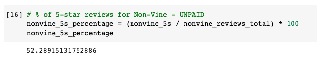

## Project Overview

This project analyzes Amazon Vine program which invole companies and users that will be paid to leave a review. It determines if there is a bias toward favorable reviews from Vine members by using PySpark with Google Colab to perform the ETL (Extract, Transform and load) to a PostgreSQL database.

The purpose of this analysis is to determine if there is a bias in the Vine Program when users give a 5 stars review and I selected the Apparel dataset.

## Resources

- Datasets: [Amazon Review datasets](https://s3.amazonaws.com/amazon-reviews-pds/tsv/index.txt), [amazon_reviews_us_Apparel_v1_00.tsv.gz dataset](https://s3.amazonaws.com/amazon-reviews-pds/tsv/amazon_reviews_us_Apparel_v1_00.tsv.gz)

- Software: Google Colab Notebook, AWS RDS, PostgreSQL 11.11, pgAdmin 4

## Results

### non-Vine and Vines reviews

- A filter of more than 20 votes has been used in order to keep "meanful" reviews and the meanful votes are over 50% of the total votes.

#### Vine Review



The "vine_program_users" is calculated with the input below:

```
vine_program_users = helpful_votes_df.filter(helpful_votes_df.vine == 'Y')
vine_program_users.show()
```

#### non-Vine Review



The "nonvine_program_users" is calculated with the input below:

```
nonvine_program_users = helpful_votes_df.filter(helpful_votes_df.vine == 'N')
nonvine_program_users.show()
```

#### Conculsion

- The total number Vine reviews in this dataset is 33, and non-Vine members is 45,388.

### 5 stars non-Vine and Vines reviews

#### Vine Review



#### non-Vine Review



#### Conculsion

- Vine reviews with 5 stars is 15, and for non-Vine reviews is 23,733.

### Percentage 5 stars non-Vine and Vines reviews

#### Vine Review



#### non-Vine Review



#### Conculsion

- The percentage of 5-star reviews for Vine members and non-Vine members respectively were 45.45% and 52.29%.

## Summary

- Either Vine or non-Vine, It doesn't seem to have a bias in 5-star reviews in Vine members.
- Additional analysis oculd be: negative reviews with high votes or quartile analysis.
